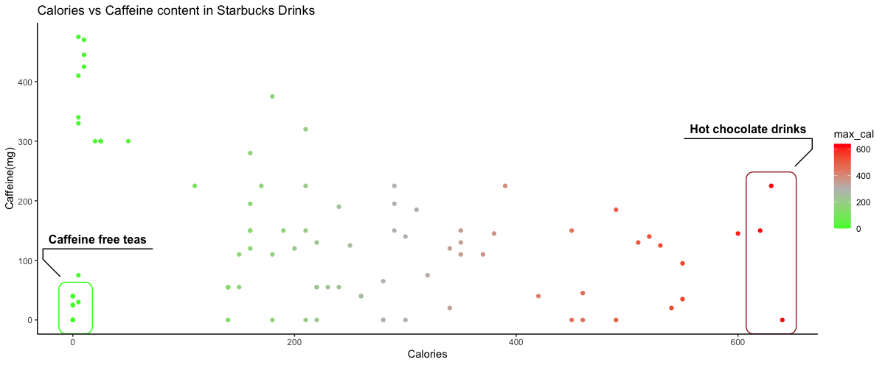

### This is my contribution for #TidyTuesday, after a long time of not participating.

### I created an interactive plot using `ggplot` and `plotly` packages that compares the calories vs caffeine content of Starbucks drinks. It's not functioning to add to this blog post, so I'll keep trying to figure that out. 

{width=50%}

#### code below:
```{r eval=FALSE, warning=FALSE, message=FALSE}
#TidyTuesday 2021, Week 52

library(tidytuesdayR)
library(dplyr)
library(ggplot2)
library(plotly)
library(htmlwidgets)

#read in data
tuesdata <- tidytuesdayR::tt_load('2021-12-21')

#load data to starbucks variable
starbucks <- tuesdata$starbucks

#group by product name and create a max_cal to calories:
starbucks <- starbucks %>%
  group_by(product_name) %>%
  mutate(max_serv_size = max(serv_size_m_l), max_cal = max(calories))

#create dateframe with simplified starbucks data.
plot_df <- starbucks %>%
  filter(serv_size_m_l == max_serv_size & calories == max_cal) %>%
  group_by(product_name) %>%
  slice(1) %>%
  filter(size != "1 scoop")

#create plot for caffeine vs calories
a = ggplot(plot_df, aes(x=max_cal, y=caffeine_mg))+
  geom_point(aes(color = max_cal))+
  scale_color_gradient2(low="green", mid = "grey", high = "red", midpoint = 300)+
  labs(x= "Calories", y= "Caffeine(mg)", title= "Calories vs Caffeine content in Starbucks Drinks")+
  geom_mark_rect(aes(filter = max_cal > 600, label = "Hot chocolate drinks"), alpha=0, show.legend = F, color = "brown") +
  geom_mark_rect(aes(filter = caffeine_mg < 45 & max_cal < 10, label = "Caffeine free teas"), alpha=0, show.legend = F, color = "green")+
  theme_classic()

#create interactive plot
interactive = ggplotly(a)

#save as html to view widget
saveWidget(as_widget(a), "plotly.html",selfcontained = F )

```

