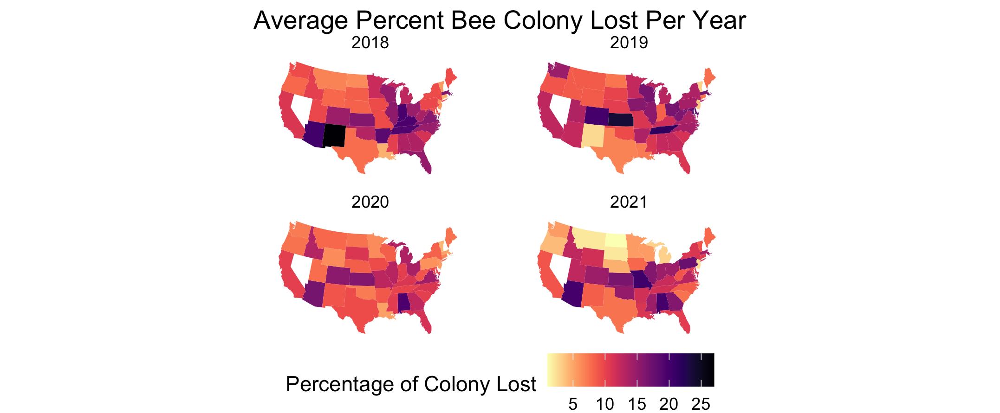

<h2> This week for '#TidyTuesday' used bee colony data collected by USDA at the state level for the US. Check it out [here](https://github.com/rfordatascience/tidytuesday/tree/master/data/2022/2022-01-11) </h2>

<h3> I decided to look at the average percent of colony decline in each state, for the last four years. The subsequent code below shows the details of how this was done. </h3>



```{r eval=FALSE, message=FALSE}
# Tidy Tuesday Week 2, 2022
# Bee Data

library(tidytuesdayR)
library(tidyverse)
library(maps)
library(viridis)
library(ggplot2)

#read in data
tuesdata <- tidytuesdayR::tt_load('2022-01-11')

colony <- readr::read_csv('https://raw.githubusercontent.com/rfordatascience/tidytuesday/master/data/2022/2022-01-11/colony.csv')
stressor <- readr::read_csv('https://raw.githubusercontent.com/rfordatascience/tidytuesday/master/data/2022/2022-01-11/stressor.csv')

#retrieve state geo data
states_map <- map_data("state")


#calculate mean of colonies lost per state 2018-2021
col_mean <- colony %>%
  mutate(state = tolower(state))%>%
  filter(year > 2017)%>%
  group_by(state, year)%>%
  summarise(col_loss=mean(na.omit(colony_lost_pct))) #na.omit critical since missing values in one month duration causes errors

#facet wrapped plot
col_mean %>%
  ggplot(aes(map_id= state)) +
  geom_map(aes(fill=col_loss), map = states_map)+
  expand_limits(x= states_map$long, y=states_map$lat)+
  coord_map("polyconic") +
  scale_fill_viridis(option = "magma", direction = -1) +
  theme_void()+
  facet_wrap(vars(year))+
  labs(fill = "Percentage of Colony Lost", title= "Average Percent Bee Colony Lost Per Year")+
  theme(legend.position="bottom", plot.title = element_text(hjust =0.5))
```
