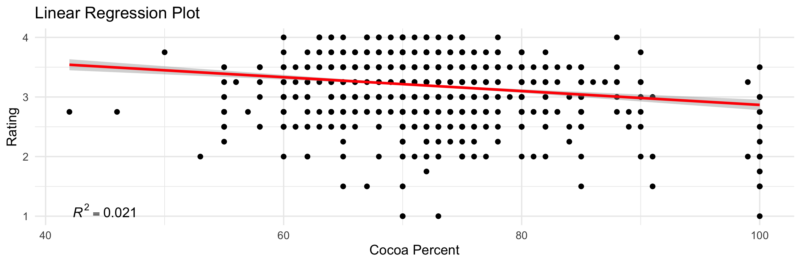

<h2> This week for `#TidyTuesday` the dataset comes from [Flavors of Cacao](http://flavorsofcacao.com/chocolate_database.html). Interesting set of information on chocolate ratings from across the world. Code below the figures. </h2>

<h3> I first wanted to look at the data statistically. I was curious if percent of cocoa in the chocolate was related to the rating. Looks like there is a significant relationship. </h3>



<h3> I then took a what other factors are possibly influencing the rating, including cocoa percent and different ingredients in the chocolate. Containing vanilla and cocoa butter are possibly influencing the chocolate ratings. </h3> 


<h3> To look at the data differently, I plotted the average rating of the chocolate based on it's origins. There were multiple chocolates that were `blends` from different countries, which do not factor into this. There is also an error in the mapping which left some countries out. </h3> 


```{r eval=FALSE}
# TidyTuesday Week 3, 2022
# Chocolate Flavor Data

library(tidytuesdayR)
library(tidyverse)
library(ggplot2)
library(sjPlot)
library(RColorBrewer)
library(maps)

#data
tuesdata <- tidytuesdayR::tt_load('2022-01-18')

chocolate <- tuesdata$chocolate

#convert cocoa_percent to a numeric
chocolate <- chocolate %>%
  mutate(
    cocoa_percent = str_extract(cocoa_percent, "\\d+") %>%
      as.numeric()
    )%>%
  mutate(country_of_bean_origin=
           recode(country_of_bean_origin,
                  "Congo"= "Republic of Congo",
                  "DR Congo"= "Democratic Republic of the Congo")
         )

#parse out ingredients by name and assign them binary coding for presence/absence
#from Jesus Castagnetto (https://github.com/jmcastagnetto/tidytuesday-kludges/blob/main/2022-01-18_chocolate/01-get-data.R)
chocolate_df<- chocolate %>%
   mutate(
     n_ingredients = str_extract(ingredients, "\\d") %>% as.numeric(),
     ingredients_list = str_extract(ingredients, "[A-Za-z,*]+")
     ) %>%
  separate_rows(
    ingredients_list,
    sep = ","
  ) %>%
  mutate(
    ingredients_list = str_replace_all(
      ingredients_list,
      c(
        "^S\\*$" = "sweetener",
        "^S$" = "sugar",
        "C" = "cocoa_butter",
        "V" = "vanilla",
        "B" = "beans",
        "L" = "lecithin",
        "^Sa$" = "salt"
      )
    ),
    ingredients_list = replace_na(ingredients_list, "unknown"),
    flag = 1
  ) %>%
  pivot_wider(
    names_from = ingredients_list,
    values_from = flag,
    values_fill = 0
  )


#simple plot of rating vs cocoa%
graph <- ggplot(chocolate_df, aes(x = cocoa_percent, y = rating)) +
  geom_point() +
  stat_smooth(method = "lm", col = "red")+
  labs(x='Cocoa Percent', y='Rating', title='Linear Regression Plot') +
  theme(plot.title = element_text(hjust=0.5, size=20, face='bold'))+
  theme_minimal()+
  annotate("text", x = 45, y = 1.1, label = "italic(R) ^ 2 == 0.021", parse= TRUE)
graph


#testing what predicts rating, if there are correlations
model1 <- lm(rating ~
               cocoa_percent,
             data= chocolate_df
               )
summary(rating)

model2 <- lm(rating ~
                cocoa_percent+
                sweetener+
                sugar+
                cocoa_butter+
                vanilla+
                beans+
                lecithin+
                salt,
              data=chocolate_df)

model3 <- lm(rating ~
                sweetener+
                sugar+
                cocoa_butter+
                vanilla+
                beans+
                lecithin+
                salt,
              data=chocolate_df)

#creating table to view results
tab_model(model1, model2, model3,
          dv.labels = c("Model 1", "Model 2", "Model 3"),
          show.ci= FALSE,show.est=F,
          show.std=T, show.stat=T, show.p= TRUE, p.style = "stars",
          string.pred = "Rating",
          string.std="B", string.stat="p")


#summarise by country
chocolate_df2 <- chocolate_df %>%
  group_by(country = country_of_bean_origin)%>%
  summarise(avg_rating=mean(na.omit(rating)),
            avg_cocoa=mean(na.omit(cocoa_percent)))

#brought in all country names due to error in making map with only those that export cocoa beans
countries <- read_csv("2022-01-18/countries.csv")

chocolate_df2 <- right_join(chocolate_df2, countries, by="country")

#retrieve country geo data
world <- map_data("world2")%>%
  filter(region != "Antarctica")

#world map
worldmap <- chocolate_df2 %>%
  ggplot(aes(map_id=country))+
  geom_map(aes(fill=avg_rating), map=world)+
  expand_limits(x= world$long, y=world$lat)+
  scale_fill_continuous(type = "viridis")+
  coord_map("mercator")+
  labs(fill = "Average Rating", title= str_wrap("Chocolate Producing Countries and Average Rating of their Chocolates", 30))+
  theme(legend.position="bottom", plot.title = element_text(hjust =0.5))+
  theme_void()
ggsave("featured.png")

```
