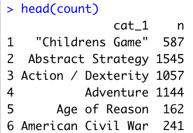
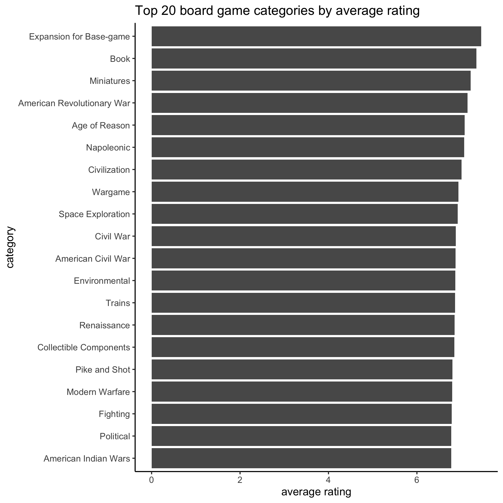
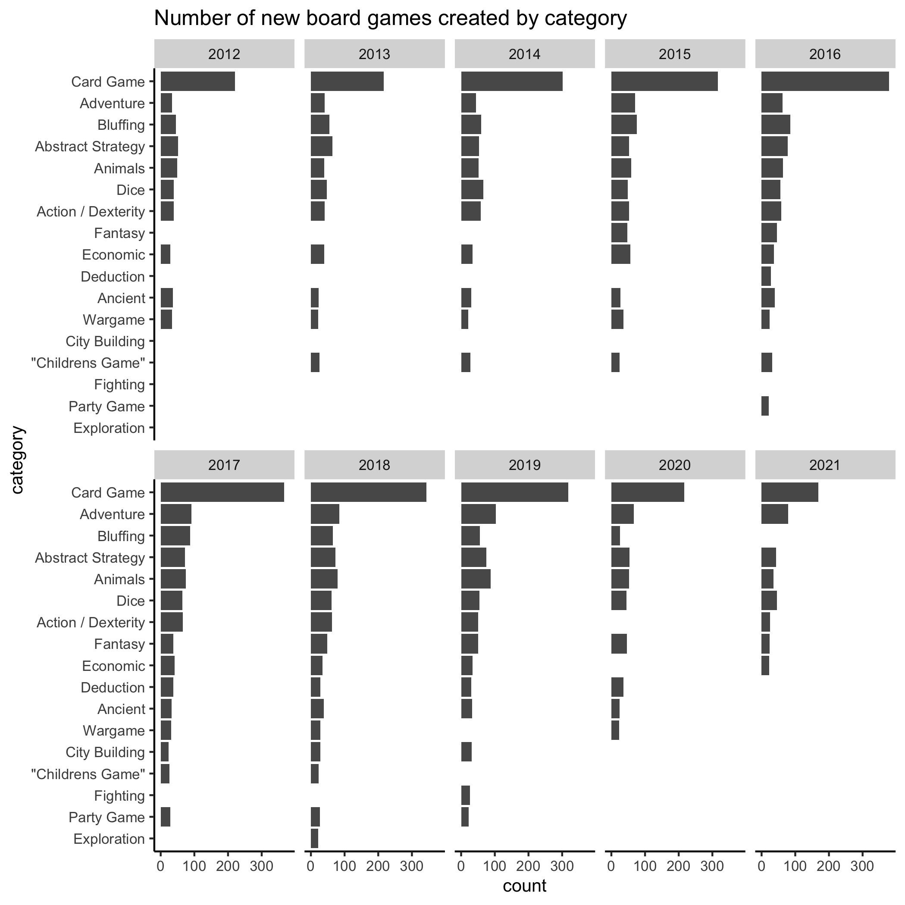

This is my contribution to 2022, Week 4  [TidyTuesday](https://github.com/rfordatascience/tidytuesday/blob/master/data/2022/2022-01-25/readme.md) using data from [Board Game Geek](https://www.kaggle.com/jvanelteren/boardgamegeek-reviews/version/3?select=2022-01-08.csv).

Starting with the packages and cleaning up the data. Some games are associated with multiple `categories` of board games. I extracted out the first two categories listed into `cat_1` and `cat_2`. 
```r
# Tidy Tuesday 2022 Week 4
library(tidytuesdayR)
library(tidyverse)
library(ggplot2)

#load data
tuesdata <- tidytuesdayR::tt_load('2022-01-25')

ratings <- tuesdata$ratings
details <- tuesdata$details

#counts number of categories for each game
details$cnt<-unlist(lapply(str_split(details$boardgamecategory, ","), length))

# seperate the boardgamecategories into the first and second listed category
details <- details %>%
  separate(col= boardgamecategory, into = c("cat_1", "cat_2"), sep = ",") %>%
  mutate(cat_1 = str_replace_all(cat_1, "\\'|\\[|\\]", ""),
         cat_2 = str_replace_all(cat_2, "\\'|\\[|\\]", "")) #removes '' and [] in categories
         
#quick count of games per category
count <- details %>% count(cat_1)
```

There were over 80 categories, many containing hundreds of different games!



I wanted to see what category has the top rated games. I grouped by `cat_1` then averaged the scorings for each category. The bar graph below shows the top 20 categories by average rating. 


```r
#change details primary to name to match join
details <- details %>%
  mutate(name = primary)

# join details to ratings
joined <- inner_join(ratings, details, by="name")

#group by cat_1
grouped <- joined %>%
  group_by(category = cat_1)%>%
  summarise(avg_rating=mean(na.omit(average)),
            avg_rank=mean(na.omit(rank))) %>%
  top_n(wt = avg_rating, 20) %>%
  add_column(color = "")

#bar plot for top 20 board game categories
ggplot(data = grouped, aes(x= reorder(category, avg_rating), y = avg_rating)) + #reorder makes bars descending order
  geom_bar(stat= "identity") +
  coord_flip() + #rotates graph
  labs(title= "Top 20 board game categories by average rating", y= "average rating",x ="category") +
  theme_classic() #introduces a theme to the figure instead of the standard output
ggsave("top.png")
```

I then wanted to look at the data by number of new games created in the top 10 categories each year. Interestingly, there are many board games created in categories that aren't the highest rated. Lots of card games are created each year, but this is not at top rated category. 



```r
#group by top category over the years
grouped2 <- joined %>%
  group_by(year, category = cat_1)%>%
  count(year, sort = TRUE) %>%
  remove_missing(na.rm= FALSE)%>%
  filter(year >"2011", year <"2022",
         n > 20)

#Create facet-wrapped figure using year as the category. 
ggplot(data = grouped2, aes(x= reorder(category, n), y = n), fill = n) + #reorder makes bars descending order
  geom_bar(stat= "identity") +
  coord_flip() +#rotates graph
  facet_wrap(vars(year), ncol= 5)+
  scale_color_continuous(palette = "Greens")+
  labs(title= "Top board games created yearly by category", y= "count",x ="category") +
  theme(panel.grid.major = element_blank(), panel.grid.minor = element_blank(),
        panel.background = element_blank(), axis.line = element_line(colour = "black"), text = element_text(size = 10))
ggsave("years.png")
```
