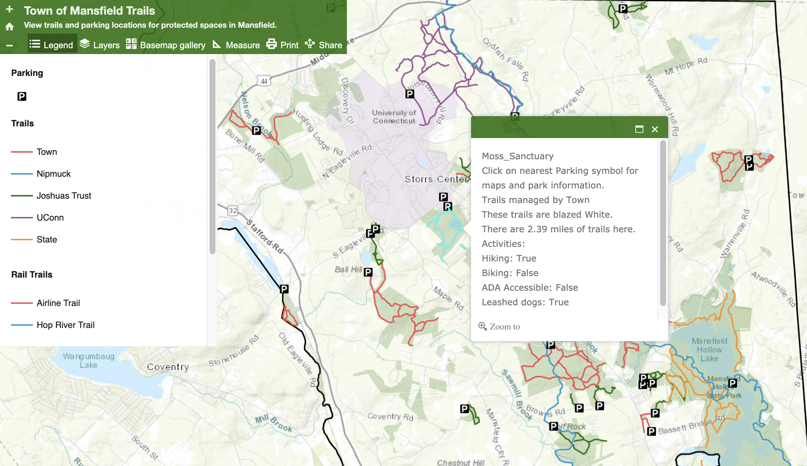

### This interactive map application allows the user to select different attributes (such as trails) to find out more information and directions to the location. This project was done in collaboration with Joshua's Trust and the town of Mansfield, CT. Pulling together town, state, and land trust trails to one place and provide useful information for those who would like to recreate in the Mansfield, CT. Created using ArcGIS Online.

### Currently, the map is not live to the public. The screen capture below shows how a user can find out information by clicking on a trail, and further understand where preserves are located in the town. 

