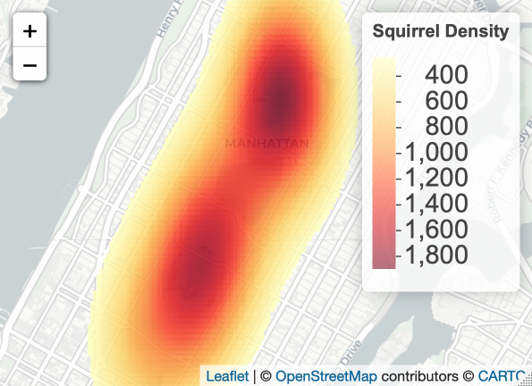
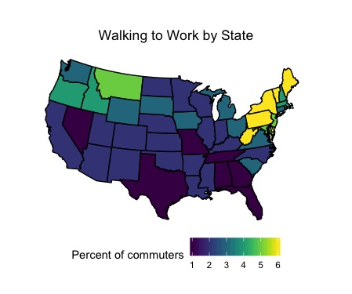

# Here are my contributions to [#TidyTuesday](https://github.com/rfordatascience/tidytuesday)

#### 2020

##### Visualization of the wildfires in Australia's New South Wales province. 
Week 1 - [Australlian Wilfires](https://github.com/rfordatascience/tidytuesday/blob/master/data/2020/2020-01-07)

#### 2019
##### Density estimation of squirrels in Central Park. 
Week 44 - [Squirrel Census](https://github.com/rfordatascience/tidytuesday/tree/master/data/2019/2019-10-29)

##### Percentage of commuters who walk to work by state. 
Week 45 - [Modes of Commuting](https://github.com/rfordatascience/tidytuesday/tree/master/data/2019/2019-11-05)

