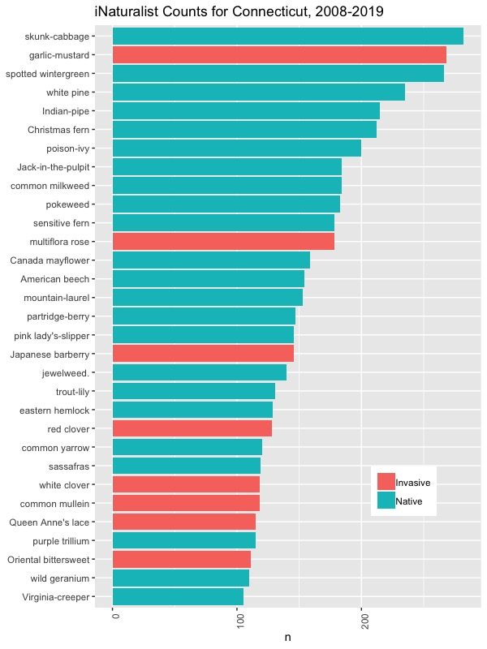
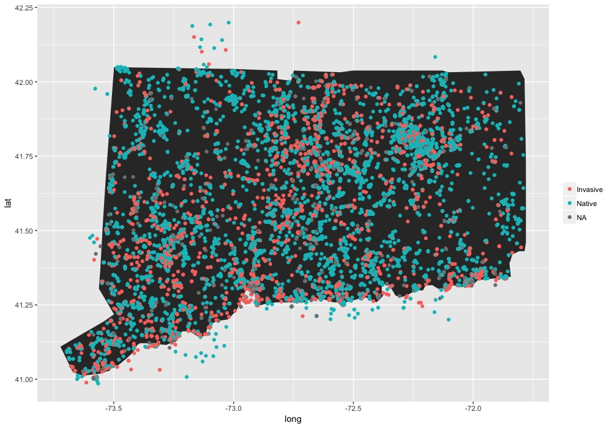

## 1) Bokeh- Python package
#### Using the Bokeh package in Python to visualize local trails and protected open space parcels. These are dynamic maps which can be zoomed into and scrolled around. Hovering over any given trail will provide the property name. Open space parcels will reveil parcel ID when hovered over.

[Mansfield Town Trails and Protected Open Space](BokehMaps_080619.html)
  

## 2) iNaturalist data analysis in R
#### I am interested in using iNaturalist data to understand distribution of species and what species are being represented by citizen scientists. There is an overwhelming amount of data collected everyday. Learning ways to utilize this data is important. I've been working on different ways to visualize iNat observations. Below are some preliminary results. I would like to understand if invasive species or native species are posted more often and where these observations occur; are there more observations near homes or protected lands? how far off trail do people go to make observations? 

### Top 30 most common plants
#### Top 30 most common observations for 10 years of iNaturalist data, separated by native and invasive. It appears that many of top observed plants are abundant species throughout most of Connecticut and mostly deer-resistant species.

 

### Native vs Invasive Observations
#### occured throughout most of the state during this 10 year period, with no apparent trend yet of invasive vs native plants. Of interest to me is the abundance of observations around specific areas, such as the UConn campus in the northeastern part of the state.

